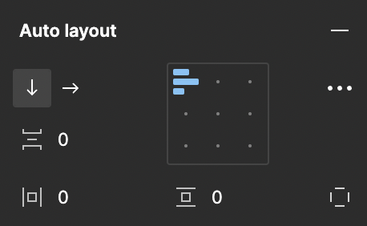
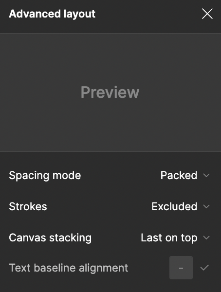
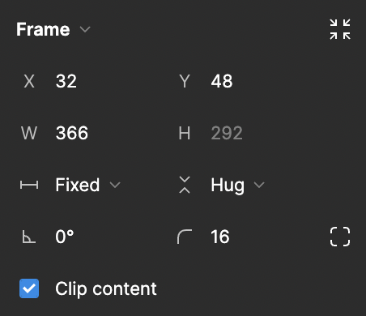
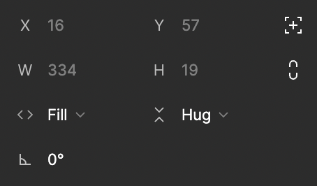

A replicate of Figma's auto layout feature that makes converting Figma designs to code faster and less error prone.


Source: figma.com

## :sparkles: Features

- [x] Vertical and horizontal layout directions
- [x] Alignment
- [x] Positive and negative spacing
- [x] Padding with independent control
- [x] Spacing mode (packed, space between)
- [x] Canvas stacking (first on top, last on top)
- [x] Text baseline alignment (on, off)
- [x] Absolute positioned children
- [x] Clip content (on, off)
- [x] Fill, hug and fixed sizing modes

### :x: Missing Features
- [x] Strokes (included in layout, excluded from layout)
- [x] Figma's constraints for absolute positioned children.

## :rocket: Getting started

Install it:
``` dart
flutter pub add figma_auto_layout
```

Import it:
``` dart
import 'package:figma_auto_layout/figma_auto_layout.dart';
```

## :joystick: Usage

### Figma's "Auto layout" features:


``` dart
FigmaAutoLayout(
    direction: Axis.vertical,
    alignment: AlignmentDirectional.topStart,
    spacing: 10.0, // Can also be a negative value.
    padding: EdgeInsets.all(10.0),
    // Use `EdgeInsets.symmetric` to control the horizontal and vertical padding seperately.
    // Use `EdgeInsets.fromLTRB` to control the padding on each side individually.
);
```

### Figma's "Advanced layout" features:


``` dart
FigmaAutoLayout(
    spacingMode: FigmaSpacingMode.packed,
    canvasStacking: StackingOrder.lastOnTop,
    textBaselineAlignment: false,
);
```

### Figma's auto layout frame features:

``` dart
FigmaAutoLayout(
    width: 50, // This will override `widthMode`.
    height: null,
    widthMode: FigmaSizingMode.fill,
    heightMode: FigmaSizingMode.hug,
    clipContent: false,
);
```

### Figma's auto layout child features:

``` dart
FigmaAutoLayout(
    children: [
        FigmaAutoLayoutChild(
            width: 50, // This will override `widthMode`.
            height: null,
            widthMode: FigmaSizingMode.fill,
            heightMode: FigmaSizingMode.hug,
            child: Container(),
        ),
    ],
);
```

### Figma's auto layout absolute positioned child features:
``` dart
FigmaAutoLayout(
    children: [
        FigmaAutoLayoutChild.absolutePositioned(
            width: 50,
            height: null, // This will match the childs height.
            top: 10,
            end: 10,
            child: Container(),
        ),
    ],
);
```

### Additional features:
``` dart
FigmaAutoLayout(
    textDirection: TextDirection.ltr,
    textBaseline: TextBaseline.alphabetic,
);
```